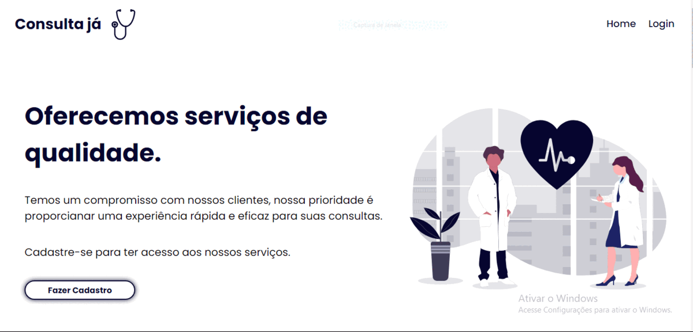
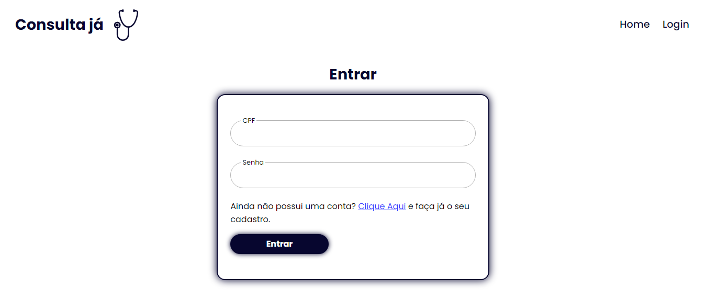
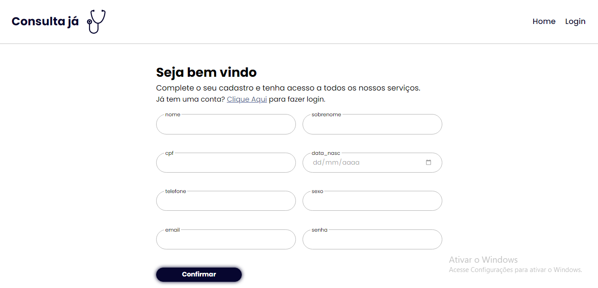
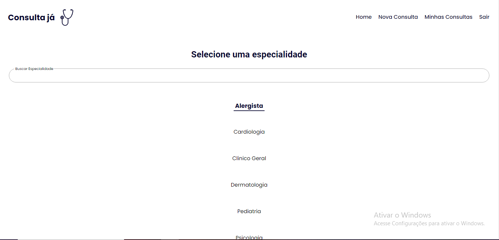
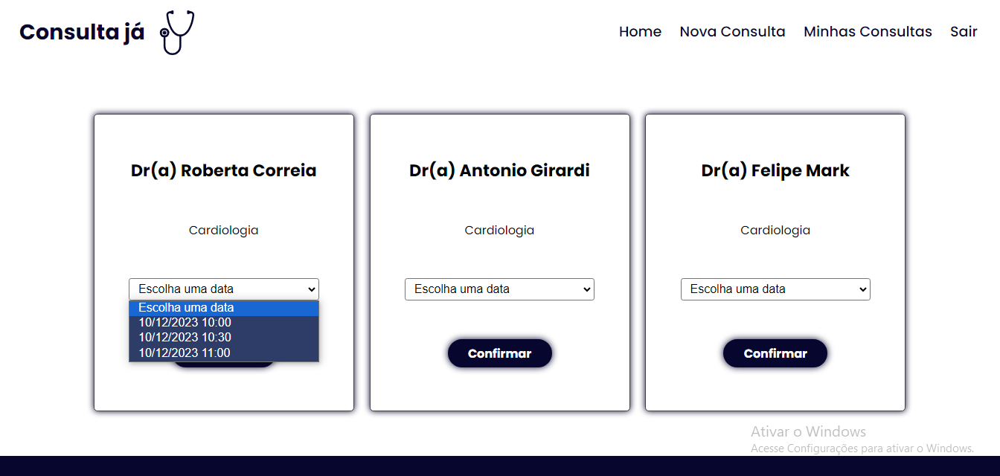
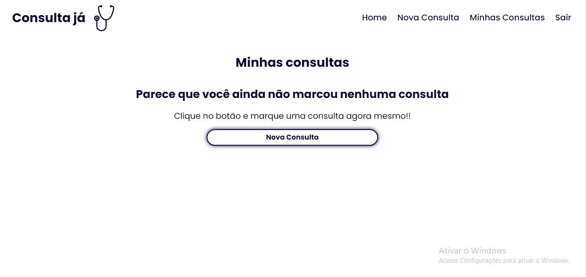
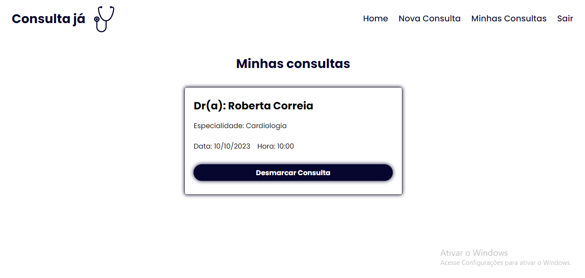
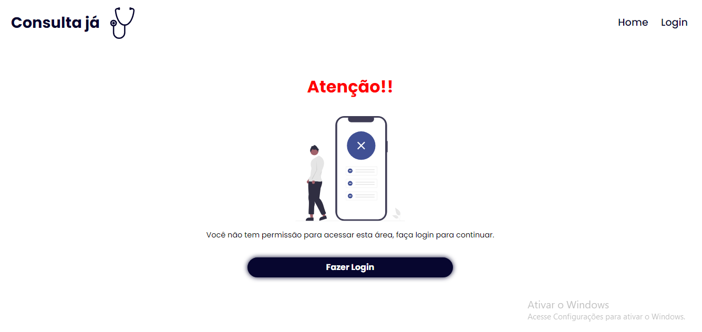

# Consulta já

Um app que serve para marcar consultas médicas.

status: em desenvolvimento.

# Dependências

- Node

- Styled Components

- React Icons

- React Router

# Get Started

- Git clone https://github.com/ArthurThz/projeto-consulta-ja

- Entre na pasta do projeto.

- execute o comando npm install

- execute o comando npm run dev

---

# Home

Descrição: Tela inicial do projeto.

<strong>Path: src/components/routes/home/Home.jsx</strong>

---

# Login Page

Descrição: Aréa em que o usuário poderá fazer o login.

<strong>Path: src/components/routes/login/Login.jsx</strong>

---

# Sign up Page

Descrição: Página em que o usuário poderá fazer o cadastro.

<strong>Path: src/components/routes/Sign-Up/Sign-Up.jsx</strong>

---

# New Appointment Page

 

Descrição: A página para marcar consultas é dividida em duas etapas, primeiro escolhemos a especialidade e depois o usuário será redirecionado para a página com os cards dos doutores da especialidade selecionada.
Cada doutor tem sua própria agenda de horários.

<strong>Path: src/components/routes/NewAppointment/NewAppointment.jsx</strong>

---

# My Appointments Page

 

Descrição: Página onde o usuário pode ver as consultas marcadas.

<strong>Path: src/components/routes/MyAppointments/MyAppointments.jsx</strong>

# Not Allowed

Descrição: Página que será mostrada caso o usuário tente entrar em alguma rota que necessita estar logado.

<strong>Path: src/components/routes/NotAllowed/NotAllowed.jsx</strong>
